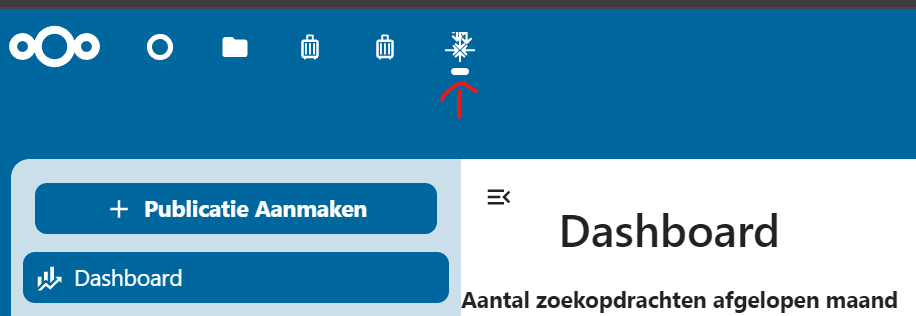

# Tutorial

1. Zorg dat je Nextcloud hebt geinstalleerd (installatiehandleiding van Nextcloud)[https://cloud.nextcloud.com/s/iyNGp8ryWxc7Efa?path=%2F1%20Setting%20up%20a%20development%20environment]
2. Zorg dat je de app geactiveerd hebt (zie onze GitBook)[https://conduction.gitbook.io/opencatalogi-nextcloud/developers/installatie-via-nextcloud-lokaal-deel-2-een-app-toevoegen]

Nadat de app succesvol is geconfigureerd vind u deze terug in het app menu van Nextcloud, klik op het OpenCatalogi-icoon om de app te openen

1. Directory (should)

Een OpenCatalogi-installatie is bedoeld om onderdeel te zijn van een federatief netwerk van catalogi, deze kunt u terugvinden onder Instellingen -> directory. In de directory staan alle, bij deze installatie bekende, catalogi die zich in andere installaties bevinden. OpenCatalogi installaties wisselen onderling hun directories uit, dus om onderdeel te worden van het federatieve netwerk moet er minimaal één andere catalogus bekend zijn.

Is uw directory leeg? Druk dan op 'listing toevoegen aan directory' achter de zoekbalk.

Catalogi worden gedefinieerd aan de hand van de plek waar ze leven op het internet (URI) geef in het formulier de volgende URI op 'url van oc eigen installatie'

2. Zoeken (should)

Nadat je de app geïnstalleerd hebt kan je het zoek scherm gebruiken om te zoeken naar gegevens bij andere organisaties. Ga hiervoor het menu item zoeken. 

3. Catalogus (must)

Publicaties worden in OpenCatalogi verderdeel catalogi

Stukje tekst met screenshots over het aanmaken van catalogi

4. Metadata (must)

Stukje tekst met screenshots over het aanmaken van metadata

5. Publicatie (must)

Stukje tekst met screenshots over het aanmaken van publicaties
Stukje tekst met screenshots over het toevoegen van gegevens aan publicaites
Stukje tekst met screenshots over het toevoegen van bestanden aan publicaites
Stukje tekst met screenshots over het publiceren aan publicaties

6. Delen (must)

Publicaties 
