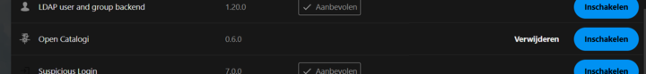

# Installatie via Demo/Test-omgeving via Docker

#### Wat Je Nodig Hebt

Om alles soepel te laten draaien, heb je het volgende nodig:

* [**Docker:**](https://www.docker.com/products/docker-desktop/) en Docker Desktop
* [**WSL2:**](https://learn.microsoft.com/en-us/windows/wsl/install) (Windows Subsystem for Linux) als je Windows gebruikt. Dit kan geïnstalleerd worden via de Microsoft Store.
* **Systeemeisen:** Minimaal 4 GB RAM en 2 CPU's

### De Applicatie Draaien in een Container van Docker

**Snel Aan de Slag**

Deze repository heeft een snelle start met een Docker Compose-bestand. Hiermee kun je de applicatie in één keer opstarten.

Volg deze eenvoudige stappen om de applicatie te starten:

1. **Download Docker Desktop**
   * Ga naar Docker Desktop en download het installatieprogramma voor jouw besturingssysteem (Windows of Mac).
   * Volg de installatie-instructies en zorg ervoor dat Docker Desktop succesvol geïnstalleerd is.
2. **Start Docker Desktop**
   * Open Docker Desktop. Het kan een paar minuten duren voordat Docker volledig is opgestart. Wacht tot je een melding krijgt dat Docker gereed is.
3. **Download de Repository**
   * Ga naar de [OpenCatalogi repository](https://github.com/ConductionNL/opencatalogi).
   * Klik op de groene knop “Code” en selecteer “Download ZIP”.
   * Pak het gedownloade ZIP-bestand uit naar een map op jouw computer.
4. **Navigeer naar de Uitgepakte Map**
   * klik op het `docker-setup.exe`-bestand. Dit start Docker op.&#x20;
   * (mocht de bovenste stap niet werken, open dan een terminal en voer het commando `docker compose up` uit in de map van de uitgepakte bestanden)
   *   Wacht tot de applicatie is opgestart. Dit kan een 5-10 minuten duren. Je ziet veel tekst voorbij komen, wacht tot je deze melding ziet:

       ```css
       [core:notice] [pid 1] AH00094: Command line: 'apache2 -D FOREGROUND'
       ```
5. **Ga naar de Webpagina**
   * Open je webbrowser en ga naar [http://localhost:8080](http://localhost:8080).
   * Maak een account aan en log in (dit werkt met admin als log **en** admin wachtwoord).
6.  **Schakel de OpenCatalogi-app in**

    * Klik op het profielicoontje rechtbovenin. Kies "Apps"

    <figure><figcaption><p>Het profielmenu, met onder andere de appinstellingen</p></figcaption></figure>

    * Kies dan links "jouw apps" en zoek "OpenCatalogi" op.

    <figure><figcaption><p>links het menu voor de appinstellingen</p></figcaption></figure>

    * Activeer de app door te klikken op inschakelen\


    <figure><figcaption><p>activatie van een app</p></figcaption></figure>
7.  **Configureer de OpenCatalogi-app**

    * Open de OpenCatalogi-app via de navigeerbalk links bovenin het scherm. Het zal het meest rechtse icoontje zijn.

    <figure><figcaption></figcaption></figure>

    * Vul bij 'instellingen' -> 'configuratie' de benodigde gegevens in:
      * Een MongoDB API met sleutel en clusternaam.
      * Voor het activeren van het zoekendpoint: een Elasticsearch met API key en index.

En dat is het! Volg deze stappen om de OpenCatalogi-app snel en soepel op te zetten.
