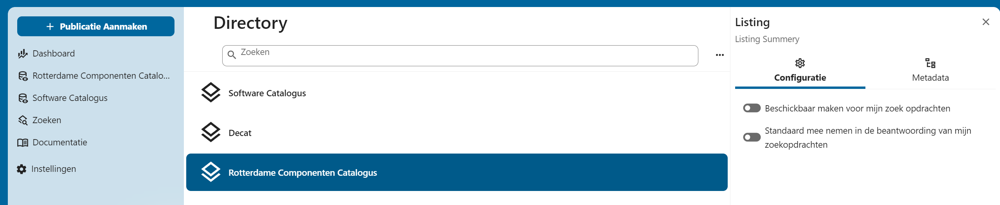
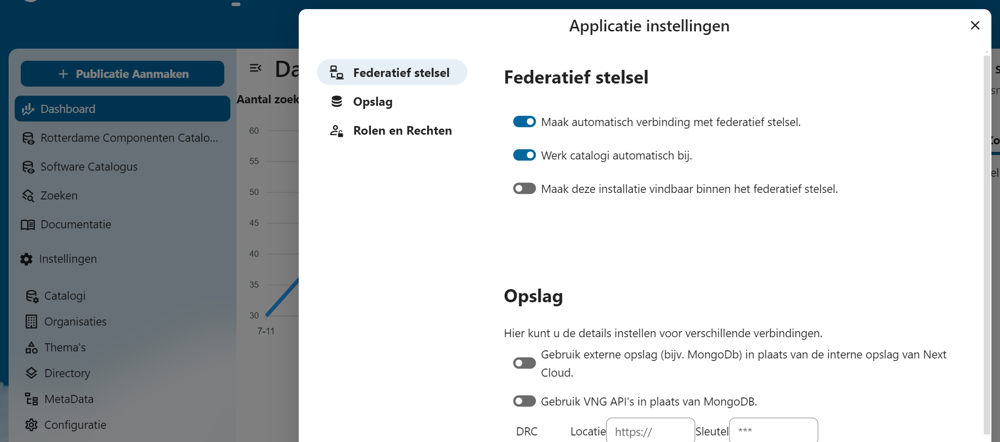
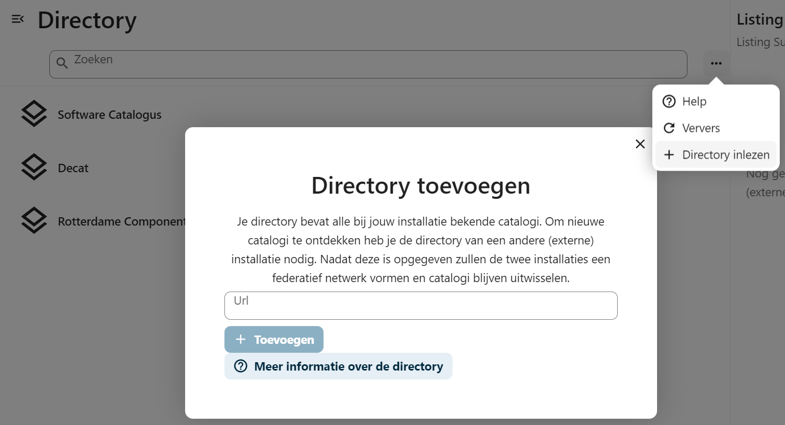

# Directory

De directory vormt het overzicht van alle andere (externe) catalogi die bij jouw installatie bekend zijn. Een Catalogus die bij jouw installatie bekend is noemen een listing (als in is gelist op jouw directory). Dat maakt directories dus een lijst van catalogi die wlders staan.

## Opzetten federatief netwerk

Directories worden tussen installaties onderling uitgewisseld en geupdate. Je hoeft dus nooit handmatig catalogi van andere toe te voegen aan jouw catalogus. Deze worden automatisch ontdekt. Wil je het automatisch ontdeken van catalogi uitzetten? Dan kan dit via instellingen -> Configuratie -> Federatief stelsel

Het is ook mogenlijk om handmatig externe directories (dus de direcotry van een andere installatie) toe te voegen, dit kan via directory inlezen.

## Listing

Bij een listing kan je de volgende zaken aanpassen.

- Of de directory beschickbaar is voor zoek opdrachten
- Of de directory standaard moet mee worden genomen in zoek resultaten, dit is met name handig als er spraken is van een samenwerkings verband waarover je woo plichtig bent als overheid

Daarnaast is het mogenlijk om metadata definities van andere catalogi over te nemen en beschickbaar te maken voor je eigen catalogus

