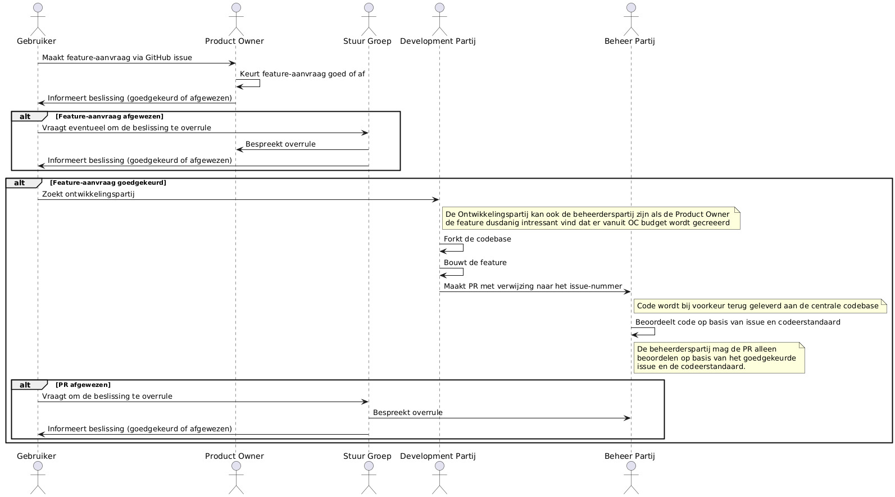

# Aan de slag met development

We gaan er voor deze stap vanuit dat je reeds een werkende lokale Nextcloud-omgeving hebt met daarin de code voor de app, heb je die nog niet kijk dan eerst onder Installatie van [Nextcloud Demo/Test-omgeving](installatie-van-nextcloud-demo-test-omgeving.md) of[Installatie van Nextcloud Development](../installatie/instructies.md)-omgeving

## Bijdragen

Als Nextcloud-app volgen we sowieso de [Nextcloud publishing guidelines](https://docs.nextcloud.com/server/19/developer_manual/app/publishing.html#app-guidelines).

Daarbovenop hanteren we een aantal extra spelregels:

* **Features moeten zijn voorzien van gebruikersdocumentatie**
* **Backend code moet zijn voorzien van automatische tests**: Code die coverage van het project verlaagd wordt niet geaccepteerd, zie ook [PHP-unit testing](https://docs.nextcloud.com/server/latest/developer_manual/server/unit-testing.html).
* **Backend code moet zuiver zijn**: Code mag *géén* linting errors bevatten
* **Frontend code moet zijn voorzien van automatische tests**: Code die coverage van het project verlaagd wordt niet geaccepteerd
* **Frontend code moet zuiver zijn**: Code mag *géén* linting errors bevatten
* **Seperation of concerns**: Voor zowel backend als frontend moet business logica zijn opgenomen in Services. Dat betekent dat Controllers, Templates, Views, Componenten en Store *géén* business logica mogen bevatten.
* **Vier ogen-principe**: Pull requests moeten zijn beoordeeld door een andere developer dan de maker voordat ze worden geaccepteerd
* **Automatische test**: Code mag alleen naar master/main als alle automatische tests goed gaan
* **Vraag gestuurde development**: Code wordt alleen geaccepteerd als deze is gekoppeld aan een door de PO goedgekeurde user story ([regel](https://github.com/OpenCatalogi/.github/issues/new/choose))

## Feature flow

In de meeste gevallen zal een wijzigingsvoorstel voor de OpenCatalogi Nextcloud app voortkomen vanuit de PO owner van OpenCatalogi ([Core](https://documentatie.opencatalogi.nl/Docs/Projecten/)) of de product owner van een van de [projecten](https://documentatie.opencatalogi.nl/Docs/Projecten/). Maar feitelijk kan iedere gebruiker een feature request indienen.

De Ontwikkelpartijen van [Core](https://documentatie.opencatalogi.nl/Docs/Projecten/) fungeren tevens als beheerpartijen voor de code base.



## Application development

Omdat de applicatie is ontwikkeld met Nextcloud, is er uitgebreide informatie te vinden in de [Nextcloud-documentatie](https://docs.nextcloud.com/server/latest/developer_manual/index.html) zelf. Dit geldt zowel voor de lay-out van de app als voor de vele componenten die eraan toegevoegd kunnen worden. Tijdens de ontwikkeling van de OpenCatalogi-app is het *documentation-first* principe gehanteerd, waarbij de ontwikkelaars eerst de [Nextcloud-documentatie](https://docs.nextcloud.com/server/latest/developer_manual/index.html) hebben geraadpleegd.

## Kwaliteit, Stabiliteit en Veiligheid

Als onderdeel van de CI/CD-straat voeren we een aantal tests uit, hiermee handhaven we zowel de code kwaliteiteisen van Nextcloud als die van onszelf. Deze testen worden geborgd in een workflow zodat je de resultaten zelf op iedere commit ziet. Let op! het falen van deze tests betekent dat de code niet naar master/main kan worden gemerged en dus niet in productie kan worden genomen.

### Voor de kwaliteit van de code maken we gebruik van linters

Voorzowel de frontend als de backend geldt dat het aantal acceptabele errors 0 is.

#### Frontend&#x20;

Voor frontend gebruiken we ESLint, de installatiehandleiding is [hier](https://www.npmjs.com/package/eslint) te vinden. Het commando om ESLint uit te voeren. ESLint is voornamelijk een linter, met enige format-functionaliteit.&#x20;

```cli
npm run lint
```


#### Backend

Voor de backend gebruiken we PHP Code Sniffer. [Zie hier](https://dev.to/xxzeroxx/phpcs-php-code-sniffer-59f4) de handleiding voor de installatiemogelijkheden. PHP-code sniffer bestaat uit een linter ( `phpcs)` en een formatter(`phpcbf`). De formatter werkt hetzelfde als de linter en kan soms aardig wat errors wegwerken. De regels voor zowel de linter als de formatter zijn te vinden in `phpcs.xml` in de root van de applicatie.&#x20;

```cli
phpcs [filename]
phpcbf [filename]
```

## Voor stabiliteit gebruiken we unit tests

Voor beide geldt dat minimale test coverage 80% is, en het aantal acceptabele errors 0.

#### Frontend

Voor het uitvoeren van de unit tests gebruiken we aan de frontend Jest. Indien je deze nog moet installeren of meer erover wilt weten, kijk dat [hier](https://www.npmjs.com/package/jest). Het uit te voeren commando is:

```cli
npm run test-coverage
```


#### Backend:

Voor het uitvoeren van de unit tests gebruiken we aan de backend PHPunit. Indien je deze nog moet installeren of meer erover wilt weten, kijk dan [hier](https://docs.phpunit.de/en/11.3/). Het uit te voeren commando is:

```cli
phpunit 
```

> **NOTE 1** We volgen de Nextcloud wijze voor unit testing, zie hier voor [de details](https://docs.nextcloud.com/server/latest/developer_manual/server/unit-testing.html), maar dit komt neer op [phpunit](https://docs.phpunit.de/en/11.3/index.html) en de juist configuratie van `phpunit.xml`en de `bootstrap.php`. Een voorbeeld van deze files zijn te vinden in de `root` van de applicatie (`phpunit.xml`) en de `/tests/unit`(`bootstrap.php`). Er zijn veel mogelijkheden om het jezelf makkelijk te maken, zoals een percentageoverzicht in de terminal. Het commando dat wij gebruiken is :

`XDEBUG_MODE=coverage phpunit --bootstrap ./tests/bootstrap.php --configuration phpunit.xml --coverage-html ./coverage --coverage-text | tee coverage.txt`

> **NOTE 2** Unit testing doe je in een draaiende container van Docker. Hiervoor kijk je met `docker ps` naar de draaiende containers. De container heet `nextcloud` of `master_nextcloud_1`. Het commando om in de container te komen is: `docker exec -it [containernaam] /bin/bash`. Je komt dan met root priviliges in `var/www/html` en moet nog navigeren naar de juiste directory met het commando `cd apps-exta/opencatalogi`. Daar werken de `phpunit`-commando's voor het uitvoeren van de unit tests.

## Voor veiligheid gebruiken we dependency scanning

#### Frontend:

```cli
npm audit
```


#### Backend

```cli
composer audit
```


Voor beide geldt dat het aantal acceptabele critical vulnerabilities 0 is.

### Gebruikersdocumentatie

We gebruiken Gitbook voor de gebruikersdocumentatie. Features binnen de app zouden zo veel mogelijk direct moeten doorverwijzen naar deze documentatie.

Ook voor de documentatie wordt een linter gebruikt namelijk [remarklint](https://github.com/remarkjs/remark-lint).

De commando's om deze linter in de CLI te gebruiken zijn [hier te vinden](https://github.com/remarkjs/remark-lint?tab=readme-ov-file#what-is-this) voor een uitgebreide output in de terminal.

## API Development

De ontwikkeling van de API wordt bijgehouden met de documentatietool [Stoplight.io](https://stoplight.io/), die automatisch een [OpenAPI Specificatie (OAS)](https://www.noraonline.nl/wiki/FS:Openapi-specification) genereert uit de documentatie. De Stoplight voor OpenCatalogi is [hier](https://conduction.stoplight.io/docs/open-catalogi/6yuj08rgf7w44-open-catalogi-api) te vinden.

## Frontend Development

### Storage en Typing

Om gegevens deelbaar te maken tussen de verschillende Vue-componenten maken we gebruik van [statemanagement](https://vuejs.org/guide/scaling-up/state-management) waarbij we het Action, State, View patroon van Vue zelf volgen. Omdat de applicatie ingewikkeld begint te worden stappen we daarbij over van [simple state management](https://vuejs.org/guide/scaling-up/state-management#simple-state-management-with-reactivity-api) naar [Pinia](https://pinia.vuejs.org/), de door Vue zelf geadviseerde opvolger van [Vuex](https://vuejs.org/guide/scaling-up/state-management#pinia).

Daarnaast gebruiken we Typescript voor het definiëren van entities.

### Modals

* Er mag altijd slechts één modal actief zijn.
* Modals moeten abstract en overal bereikbaar zijn.
* Modals moeten geplaatst worden in de map src/modals.
* Modals moeten getriggerd worden via de state (zodat knoppen die modal openen overal plaatsbaar zijn).
* Modals moeten geïmporteerd worden via `/src/modals/Modals.vue`.

### Views

* Views moeten dezelfde bestandsnaam hebben als de geëxporteerde naam en een correlatie hebben met de map waarin het bestand zich bevindt.
* Bijvoorbeeld, als het bestand een detailpagina is en het zich in de map `publications` bevindt, moet het bestand de naam `PublicationDetail.vue` hebben.

## Documentatie

Het is goed om bij development kennnis te nemen/hebben van de volgende gebruikte Nextcloud onderdelen:

* [Icons](https://pictogrammers.com/library/mdi/)
* [Layout](https://docs.nextcloud.com/server/latest/developer_manual/design/layout.html)-
* [Componenten](https://nextcloud-vue-components.netlify.app/)
