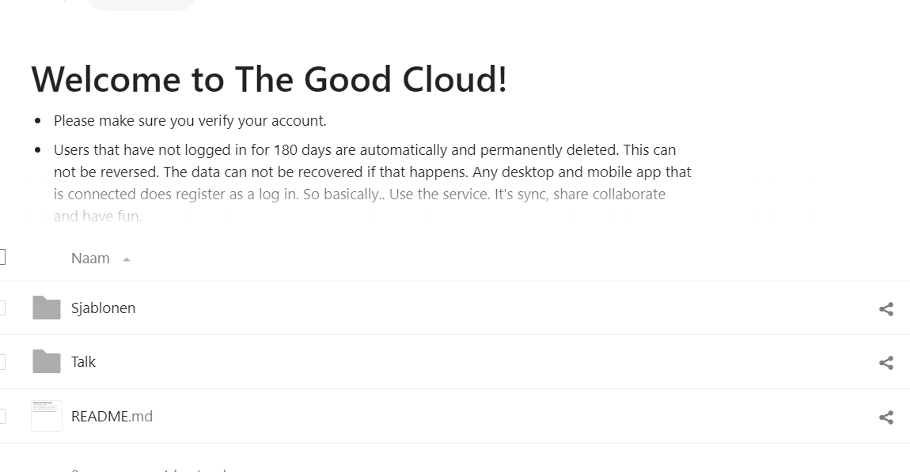

# De OpenCatalogi-app toevoegen aan Nextcloud

We gaan er voor deze stap vanuit dat je reeds een werkende lokale Nextcloud-omgeving hebt met daarin de code voor de app, heb je die nog niet kijk dan eerst onder Installatie van [Nextcloud Demo/Test-omgeving](installatie-van-nextcloud-demo-test-omgeving.md) of[ Installatie van Nextcloud Development](../installatie/instructies.md)-omgeving

De code voor de app staat er nu, maar in Nextcloud moeten apps geactiveerd worden voor gebruik. Hiervoor kan er geklikt worden op het profiel icoontje rechts bovenin. Kies voor "Apps".

<figure><figcaption>
Het profielmenu
</figcaption></figure>

In het volgende scherm, zie je aan de linkerzijde een navigatie menu. Klik op "Disabled apps". Je ziet een overzicht met de apps die in de "apps-extra"-directory zitten.&#x20;

<figure><figcaption></figcaption></figure>

Zodra je klikt op "enable" verschijnt deze links bovenin, naast het Nextcloud logo. Dit zijn de shortcut-icoontjes voor de geactiveerde applicaties. \
\
\
Klik op het icoontje van OpenCatalogi en je zit in de app!

<figure><figcaption></figcaption></figure>
