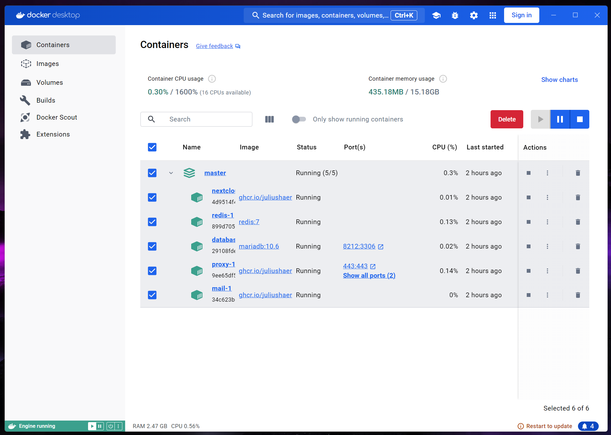

# Installatie van Nextcloud Demo/Test-omgeving

## Wat Je Nodig Hebt

Om alles soepel te laten draaien, heb je het volgende nodig:

* [**Docker:**](https://www.docker.com/products/docker-desktop/) en Docker Desktop
* [**WSL2:**](https://learn.microsoft.com/en-us/windows/wsl/install) (Windows Subsystem for Linux) als je Windows gebruikt. Dit kan geïnstalleerd worden via de Microsoft Store.
* **Systeemeisen:** Minimaal 4 GB RAM en 2 CPU's

## Aan de slag

Deze repository heeft een snelle start met een Docker Compose-bestand. Hiermee kun je de applicatie in één keer opstarten.

Volg deze eenvoudige stappen om de applicatie te starten:

1. **Docker Desktop**: [Download](https://www.docker.com/products/docker-desktop/) en installeer Docker Desktop.
2. **WSL2**: [Download](https://learn.microsoft.com/en-us/windows/wsl/install) en installeer via de Microsoft Store.
3. **Code**: [Download](https://github.com/ConductionNL/opencatalogi/archive/refs/heads/master.zip) de code als zip bestand en pak deze uit.
4. **(Optie 1, Start Docker via installer)**
   * [Download](https://raw.githubusercontent.com/OpenCatalogi/.github/main/docs/assets/Start-docker.bat) het `.bat`-bestand. Dit doe je door de link op te slaan (rechtermuisknop opslaan als, let op dat je het bestand opslaat als `.bat`)
   * Plaats het bestand als `.bat` in dezelfde folder als de code.
   * Klik met de rechtermuisknop op het bestand en selecteer uitvoeren **(Optie 2, via command line interface)**
   * Type het volgende commando in de Command prompt en druk op Enter:

     `cd pad/naar/uitgepakte/map`
   * Vervang `pad/naar/uitgepakte/map` door de locatie waar je de bestanden hebt uitgepakt. Bijvoorbeeld:

     `cd C:\Users\{{jouwgebruikersnaam}}\Downloads\opencatalogi-main`
   * Typ het volgende commando in de command prompt en druk op Enter:

     `docker compose up`
   * Wacht tot de applicatie is opgestart. Je ziet veel tekst voorbij komen, het kan 5-10 minuten duren voordat je deze laatste melding ziet:

     `[core:notice] [pid 1] AH00094: Command line: 'apache2 -D FOREGROUND'`
5. **Open de applicatie**: Open je webbrowser en ga naar <http://localhost:8080>
6. **Login**: Voor de standaardinstallatie werkt dit met admin als log **en** admin wachtwoord

Je hebt nu een werkende Nextcloud-test en demo-omgeving. Om OpenCatalogi te activeren, volg dan [deze stappen](de-opencatalogi-app-toevoegen-aan-nextcloud.md)

En dat is het! Volg deze stappen om de OpenCatalogi-app snel en soepel op te zetten.

## De-installeren

Het kan natuurlijk voorkomen dat je na een succesvolle demonstratie de toepassing wil de-installeren, open daarvoor de Docker Desktop interface en

* Vink onder `containers` alle containers aan en druk op 'delete'
* Vink onder `images` alle images aan en druk op 'delete'
* Vink onder `volumes` alle volumes aan en druk op 'delete'
* Verwijder de folder met bestanden die in stap 3 van het installatieproces heb aangemaakt

## Bijwerken

Vanuit de demo-installatie route is er nog geen optie beschikbaar voor het bijwerken van de applicatie, die zal je moeten de-installeren en installeren.
