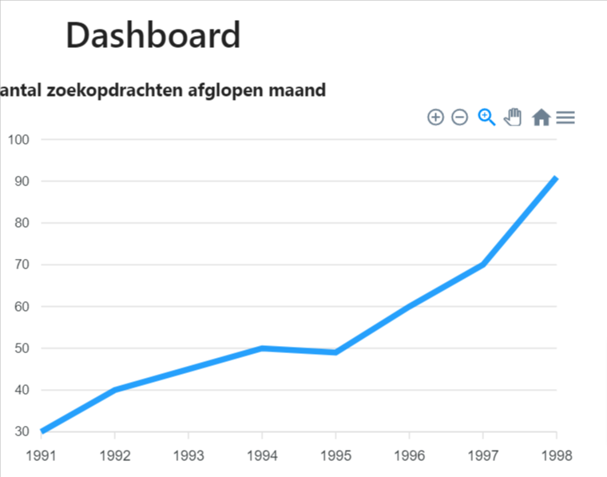

***

description: >-
Deze handleiding gaat ervan uit dat de gebruiker beschikt tot een werkende
OpenCatalogi-Nextcloud app
--------------------------

# Dashboard

***

## Dashboard

Op het dashboard van OpenCatalogi vindt u handige informatie die je meteen verder helpt en in staat stelt de juiste keuzes te maken. Aan de linkerkant tref je een aantal overzichtsstatistieken en aan de rechterkant een sidebar met daarin de mogelijkheid om direct actie te ondernemen.

### Statistieken

1. **Zoekverkeer** Het aantal zoekvragen dat er afgelopen maand aan jouw index (geheel van catalogi) is gesteld.
2. **Metadata** De verdeling over metadata-types van jouw publicaties
3. **Status** De verdeling over statustypes van jouw publicaties

### Sidebar

Vanuit de sidebar heb je toegang tot 3 tabbladen

1. **Zoeken** Voor het direct en snel uitvoeren van een zoekopdracht.
2. **Publicaties** Met daarin alle publicaties van de status `concept`
3. **Bijlagen** Met daarin alle bijlagen van de status `concept`

Zo is snel te zien waar jouw aandacht benodigd is en kan je actie ondernemen.
