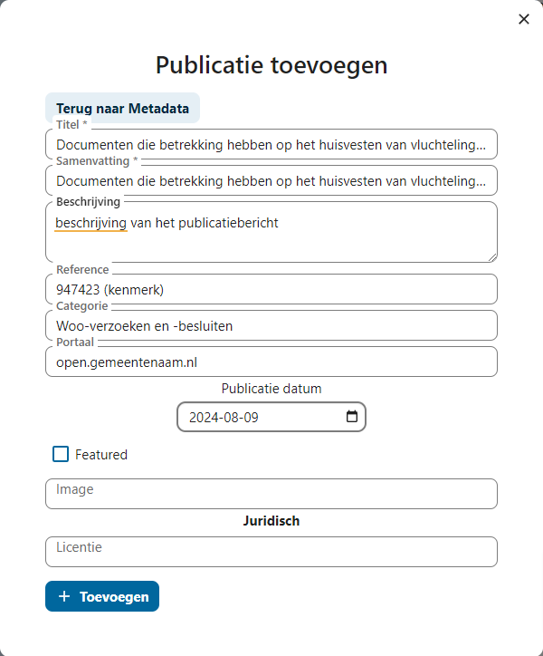
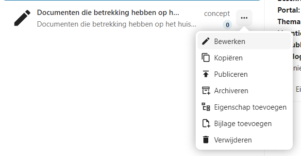
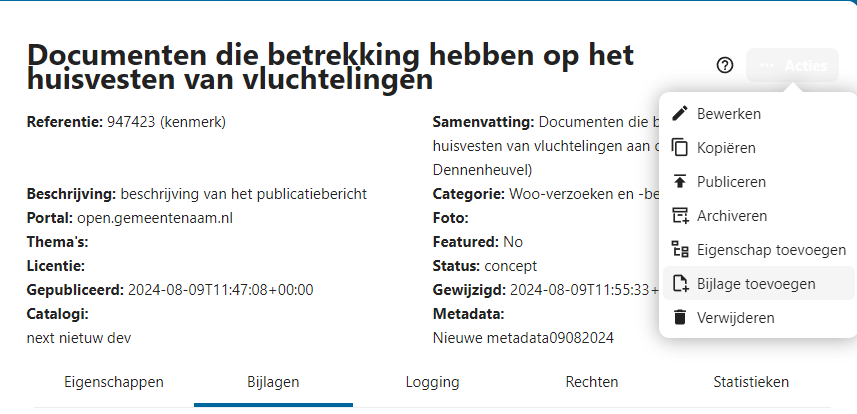

# Publicaties

Publicaties zijn onderdeel van de [Open Catalogi Standaard](https://github.com/OpenCatalogi/.github/blob/main/docs/Standaard.md) en gebaseerd op het [publication object](https://conduction.stoplight.io/docs/open-catalogi/9bebd6bf4fe35-publication). Publicaties kennen eigenschappen zoals gedefinieerd in een publicatietype en kunnen worden gekoppeld aan bijlagen

## Publicaties toevoegen

Publicaties kunnen worden toegevoegd via:

* De publicatie toevoegen knop boven aan het hoofd menu (links)
* Een catalogus geselecteerd in het hoofdmenu (via het hamburgermenu achter de zoekbalk)
* Een catalogus detailpagina

Een publicatie leeft altijd binnen één catalogus en wordt gedefinieerd door één publicatietype. Omdat catalogi bepalen welke publicatietypen beschikbaar zijn voor die catalogi moet er eerst een catalogus worden gekozen voordat er een metadatatype kan worden gekozen. Daarmee wordt de volgorde bij het aanmaken van een publicatie:

1. Catalogus kiezen (indien niet opgestart vanuit een specifieke catalogus)
2. Publicatietype kiezen
3. Publicatiedetails aanvullen

Eigenschappen en bijlagen kunnen worden toegevoegd nadat de publicatie is toegevoegd.

## Publicaties beheren

De gebruikersbeheerinterface werkt intuïtief. Aan de linkerkant van de pagina bevindt zich een overzicht van catalogi. Met de blauwe knop bovenaan kun je een publicatie aanmaken. Dit opent een modal genaamd "Publicatie toevoegen". Er wordt eerst gevraagd aan welke catalogus deze behoort en welke publicatietype het heeft (metadata)

Hieronder is een voorbeeld van een ingevulde modal voor het aanmaken van een Woo-publicatie.

<figure><figcaption>
De publicatiemodal
</figcaption></figure>

Na het opslaan van de publicatie, is deze zichtbaar onder de catalogi "Woo". Om de publicatie aan te passen, te depubliceren of andere acties uit te voeren, klik je op de blauwe "Actie"-knop rechtsboven bij de getoonde publicatie, of de drie puntjes rechts van de publicatie zelf.\\

Onder is een voorbeeld van een publicatie en de Actie-mogelijkheden.

## Eigenschappen

@todo

## Bijlagen

Publicaties hebben vaak bijlagen, zoals een verslag of een besluit. Deze zijn eenvoudig toe te voegen door op de Actie-knop te klikken bij een geselecteerde publicatie, of de drie bolletjes naast een publicatie. Dit opent de Bijlage toevoegen modal.

<figure><figcaption>
bijlage toevoegen via drie bolletjes
</figcaption></figure>

<figure><figcaption>
bijlage toevoegen via de actie-knop
</figcaption></figure>

In de `Bijlage toevoegen`-modal worden er gevraagd om een aantal velden. Er zijn twee mogelijkheden een bijlage toe te voegen. De eerste manier is via een  `Toegangs URL`. Dit zorgt ervoor dat het bestand vanuit een andere plek automatisch gedownload wordt.  Een `Titel` is dan verplicht.&#x20;

De tweede manier is door zelf een bestand up te loaden. De bestandsnaam wordt dan meegegeven.&#x20;
