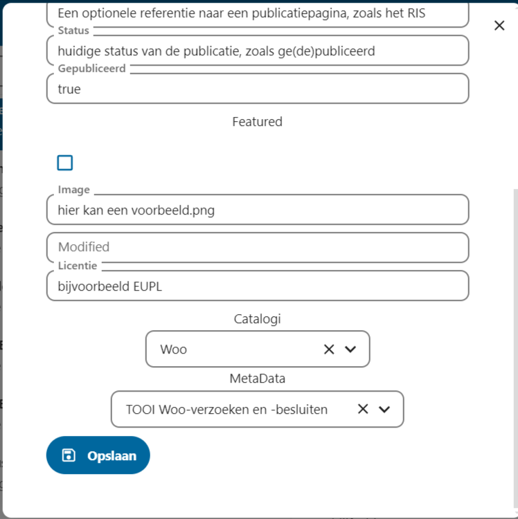

# Publicaties

> Publicaties zijn onderdeel van de (Open Catalogi Standaard)\[] en gebaseerd op het [publication object](https://conduction.stoplight.io/docs/open-catalogi/9bebd6bf4fe35-publication). Publicaties kennen eigenschappen zo als gedefineerd in een publicatietype en kunnen worden gekoppeld aan bijlagen

## Publicaties toevoegen

Publicaties kunnen worden toegevoegd via:

* De publicatie toevoegen knop boven aan het hoofd menu (links)
* Een catalogus geselecteerd in het hoofdmenu (via het hamburgermenu achter de zoekbalk)
* Een catalogus detailpagina

Een publicatie leeft altijd binnen één catalogus en wordt gedefinieerd door één publicatietype. Omdat catalogi bepalen welke publicatietypen beschikbaar zijn voor die catalogi moet er eerst een catalogus worden gekozen voordat er een metadatatype kan worden gekozen. Daarmee wordt de volgorde bij het aanmaken van een publicatie:

1. Catalogus kiezen (indien niet opgestart vanuit een specifieke catalogus)
2. Publicatietype kiezen
3. Publicatiedetails aanvullen

Eigenschappen en bijlagen kunnen worden toegevoegd nadat de publicatie is toegevoegd.

## Publicaties beheren

De gebruikersbeheerinterface werkt intuïtief. Aan de linkerkant van de pagina bevindt zich een overzicht van catalogi. Met de blauwe knop bovenaan kun je een publicatie aanmaken. Dit opent een modal genaamd "Publicatie toevoegen".

Hieronder is een voorbeeld van een ingevulde modal voor het aanmaken van een Woo-publicatie.

<figure><figcaption>
Het eerste gedeelte - gegevens over de publicatie
</figcaption></figure>

<figure><figcaption>
het tweede gedeelte - het aanwijzen van de catalogi
</figcaption></figure>

Na het opslaan van de publicatie, is deze zichtbaar onder de catalogi "Woo". Om de publicatie aan te passen, te depubliceren of andere acties uit te voeren, klik je op de blauwe "Actie"-knop rechtsboven bij de getoonde publicatie, of de drie puntjes rechts van de publicatie zelf.\\

Onder is een voorbeeld van een publicatie en de Actie-mogelijkheden.

<figure><figcaption></figcaption></figure>

## Eigenschappen

@todo

## Bijlagen

@todo
