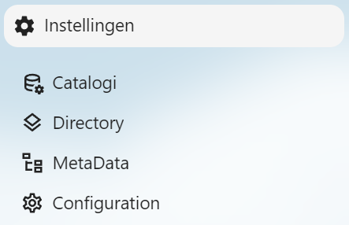
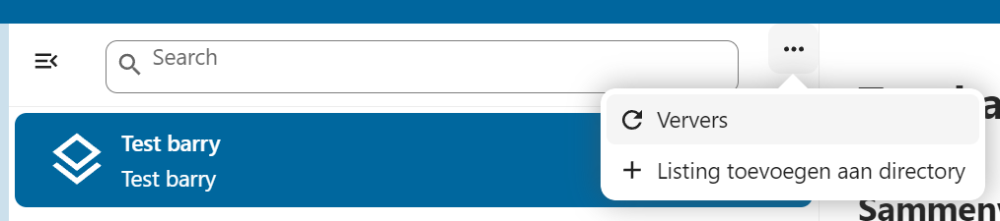
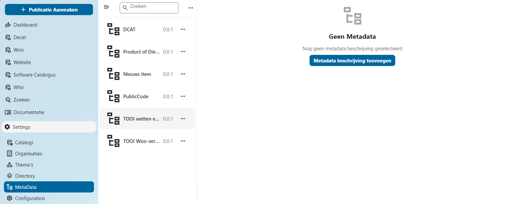
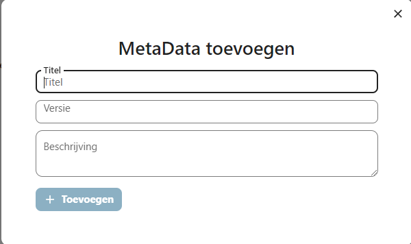
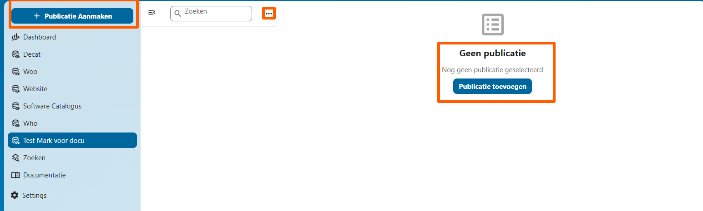
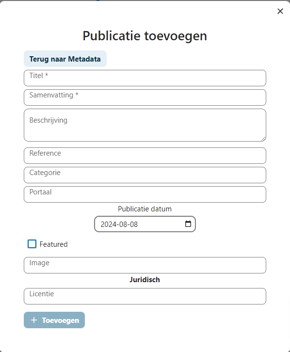
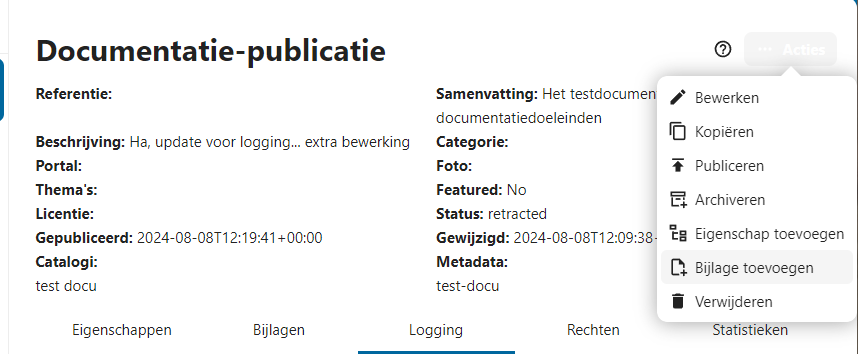
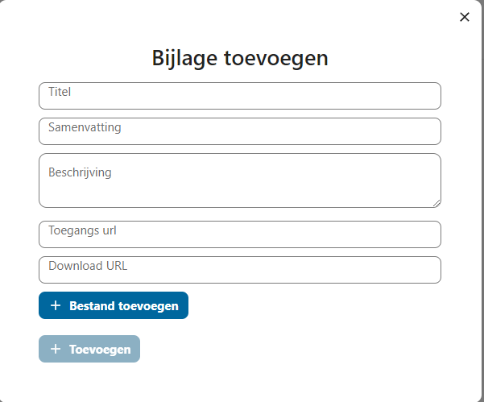

# Tutorial

1. Zorg dat je Nextcloud hebt geïnstalleerd [link naar installatiehandleiding](https://cloud.nextcloud.com/s/iyNGp8ryWxc7Efa?path=%2F1%20Setting%20up%20a%20development%20environment).
2. De OpenCatalogi code is de `apps-extra`-folder hebt. [link naar de app ](../developers/installatie-van-nextcloud-development-omgeving.md)code
3. Zorg dat je de app geactiveerd hebt [link naar configuratie](../developers/de-opencatalogi-app-toevoegen-aan-nextcloud.md).

Nadat de app succesvol is geconfigureerd, vind je deze terug in het app-menu van Nextcloud. Klik op het 'OpenCatalogi'-icoon om de app te openen. De tutorial gaat uit van een lege installatie.

.png>)

## Directory

Een OpenCatalogi-installatie is bedoeld om onderdeel te zijn van een federatief netwerk van catalogi. Deze kunt u terugvinden onder Instellingen -> Directory. In de directory staan alle bij deze installatie bekende catalogi die zich in andere installaties bevinden. OpenCatalogi-installaties wisselen onderling hun directory uit, dus om onderdeel te worden van het federatieve netwerk moet er minimaal één andere catalogus bekend zijn.

Is uw directory leeg? Druk dan op 'Listing toevoegen aan directory' achter de zoekbalk.

Catalogi worden gedefinieerd aan de hand van de plek waar ze leven op het internet (URI). Geef in het formulier de volgende URI op: 'URL van uw eigen OpenCatalogi-installatie'.

## Zoeken

Nadat je de app geïnstalleerd hebt, kun je het zoekscherm gebruiken om te zoeken naar gegevens bij andere organisaties. Ga hiervoor naar het menu-item 'Zoeken'.

Aan de linkerkant worden de gevonden publicaties weergegeven, terwijl aan de rechterkant in tabbladen de zoekmiddelen beschikbaar zijn:

* **Zoeken**: Het algemene zoekveld en de zoekknop.
* **Catalogi**: Hierin kun je aangeven in welke actieve catalogi je wilt zoeken die relevant zijn voor jouw organisatie.
* **Metadata**: Hierin kun je aangeven naar welke actieve metadatatypes je wilt zoeken die relevant zijn voor jouw organisatie.

### Catalogus

Publicaties worden in OpenCatalogi onderverdeeld in catalogi.

Het aanmaken van een eigen catalogus kan eenvoudig door te navigeren naar `Instellingen` en te kiezen voor Catalogi. Aan de linkerzijde zie je de knop `Catalogi toevoegen`. Voor het aanmaken van een Catalogus is alleen een `titel` verplicht.&#x20;

<figure><figcaption>
Het overzicht voor Instellingen en de aanmaken-knop
</figcaption></figure>

<figure><figcaption>
De modal voor metadata, zoals titel en samenvatting
</figcaption></figure>

## Metadatabeschrijving

Metadata beschrijft een publicatie. Er wordt er informatie meegegeven over het publicatietype.&#x20;

Het aanmaken van een eigen catalogus kan eenvoudig door te navigeren naar `Instellingen` en te kiezen voor `Metadata`. Aan de linkerzijde zie je de knop `Metadatabeschrijving toevoegen`. Voor het aanmaken van `Metadata` is alleen een `titel` verplicht.

<figure><figcaption>
Selecteren van Metadata onder "Instellingen"
</figcaption></figure>

<figure><figcaption>
Modal voor het toevoegen van Metadatabeschrijvingen
</figcaption></figure>

## Publicatie

Aan de linkerkant bevindt zich een navigatiebalk met verschillende menuopties. Bovenaan de navigatiebalk is een blauwe knop zichtbaar met de tekst `Publicatie Aanmaken`.

In het hoofdgedeelte van het scherm, aan de rechterkant, is er een melding die aangeeft dat er nog geen publicatie is geselecteerd, met de tekst `Geen publicatie`. Onder deze melding staat een blauwe knop met de tekst `Publicatie toevoegen`.

Bovenaan het hoofdgedeelte is er een zoekbalk met een vergrootglas-icoon en een tekstveld om zoekopdrachten in te voeren. Rechts naast de zoekbalk is er een icoon met drie verticale puntjes.

Het scherm is gebruiksvriendelijk ontworpen en biedt eenvoudige navigatie en duidelijke opties voor het aanmaken en toevoegen van publicaties.\
\
Bij het aanmaken van een publicatie zijn een aantal zaken van belang. Een publicatie behoort altijd tot een catalogus, dus die moet geselecteerd worden, net als metadata.

<figure><figcaption>
De drie manieren met een hoek 
</figcaption></figure>

<figure><figcaption>
Modal voor het oevoegen van publicaties
</figcaption></figure>

## Bijlagen toevoegen

Sommige publicaites hebben een bijlagen, zoals bijvoorbeeld voor convenanten het geval is. Een bijlage toevoegen aan een publicatie wordt gedaan door te klikken op de `Actie`-knop die rechtsboven te vinden is bij het klikken op een publicatie. Een van die opties is `Bijlage toevoegen`. Dit zorgt voor het tonen van de `Bijlage toevoegen`-modal. Hier kan via `url` of door een bestand toe te voegen vanaf de harde schrijf.&#x20;

<figure><figcaption>
Overzicht actie-knop publicaties
</figcaption></figure>

<figure><figcaption>
Modal voor het toevoegen van bijlagen
</figcaption></figure>

## Delen

Stukje tekst met screenshots over het publiceren van publicaties. Stukje tekst over het terugtrekken van een publicatie.\
\
Na het aanmaken van een publicatie is een publicatie makkelijk te delen (publiceren) door deze openbaar te maken. Dit kan door naar de drie bolletjes te gaan naast de publicatie en te kiezen voor `publiceren`. \
\
Op dezelfde plek is de optie `depubliceren` te vinden. Dit is gebeurd in het onderstaande screenshot, waar ook de status `retracted` te zien is.&#x20;

<figure><figcaption>
Overzicht actiemenu voor het (de)publiceren
</figcaption></figure>

