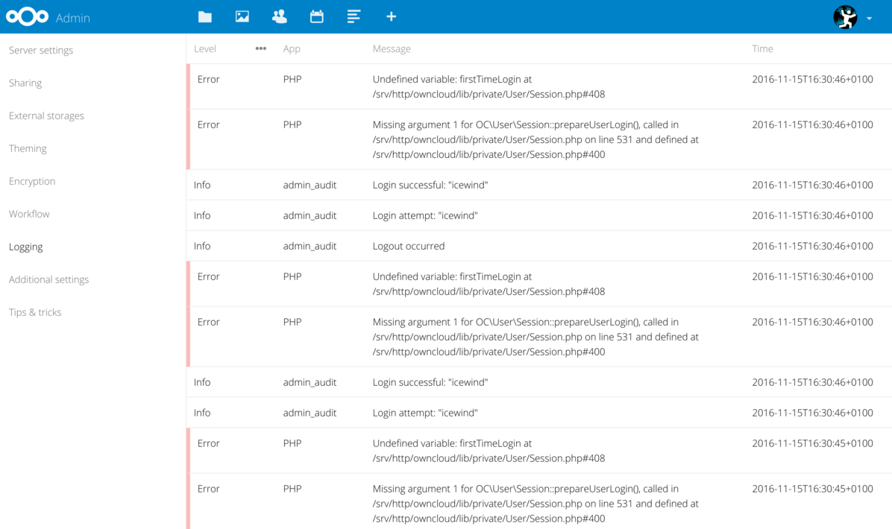

# Audit en logging

Voor logging maken we gebruik van de ingebouwde admin\_audit systematiek van next cloud, meer daarover kan je [hier](https://docs.nextcloud.com/server/29/admin_manual/configuration_server/logging_configuration.html#admin-audit-log) vinden.

## System logging

Als audit trails aanstaan worden automatisch alle systeemfouten gelogd, die kunnen vervolgens worden ingezien met [log reader](https://github.com/nextcloud/logreader) (admin->logging)

## Change logging

Wijzigings- (pogingen) worden gelogd via API calls. Dit vanwege twee reden:

1. Zo loggen we alle pogingen, ongeacht of ze via de functioneel beheer omgeving of een specifieke afhandel applicatie zijn gemaakt
2. We loggen pogingen, dus ook mislukte wijzigingen (bijvoorbeeld vanwege foutieve invoer of rechten) worden bijgehouden

Deze logs zijn generiek in te zien via [log reader](https://github.com/nextcloud/logreader) of specifiek via de functioneel beheer interface.

## Security logging

Foutieve inlogpogingen, overmatige bevragingen, ongeldige invoer etc. worden allemaal weggeschreven naar de logs zijn daarin dus terug te vinden via log reader of te exporteren naar een dashboard dat meerdere installaties volgt.

## Via Loki, Prometheus en Grafana

We raden sterk aan om op SaaS-omgevingen gebruik te maken van dashboard om (verdacht) gedrag van gebruiker te volgen naar de algemene gezondheid van de installatie. Dit is zeker raadzaam binnen S[aaS-omgevingen](saas.md) waarbij er doorgaan gebruik wordt gemaakt van één installatie per tenant (klant). Overzicht houden wordt dan snel moeilijk tot onmogelijk en op performance en security wil je proactief acteren.

Vanuit de Nextcloud-community is er een mooie [tutorial](https://okxo.de/monitor-your-nextcloud-logs-for-suspicious-activities/) beschikbaar over hoe je de Nextcloud-audit trails kan overbrengen naar je Grafana-dashboard zodat je zicht hebt op (bijvoorbeeld) mislukte inlog pogingen.
