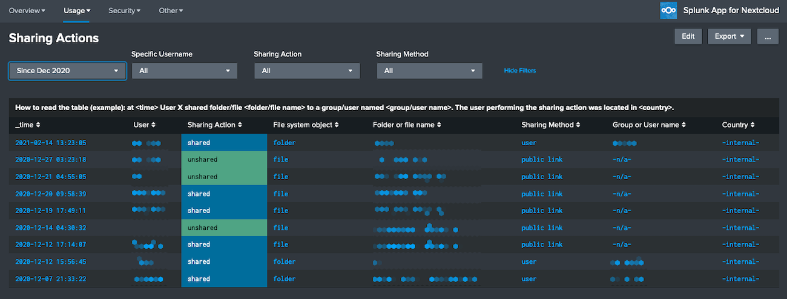
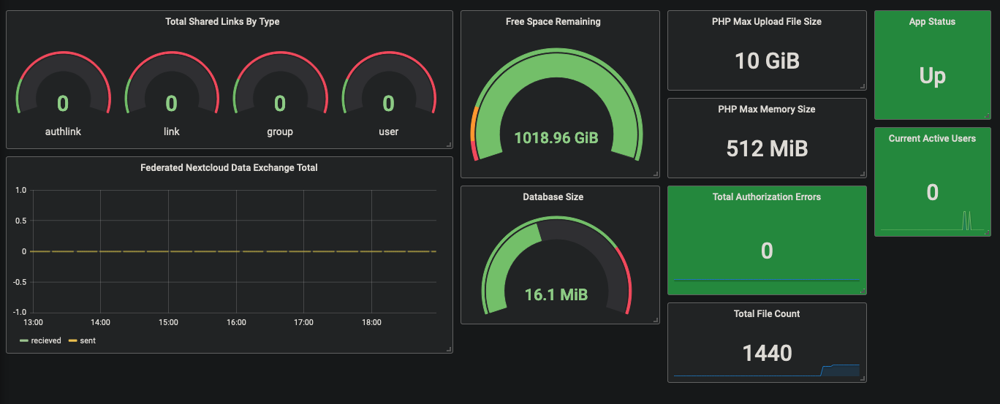

# SAAS en Dashboarding

De open catalogi nextcloud app is ontworpen om als SAAS dienst te worden aangeboden aan overheden,

## Multy tenancy by installion

Meerdere tenants in apparte namespaces

# Dashboarding
Als je de Open Catalogi app aan de hand van nextcloud aan verschillende gemeenten wil aanbieden is het organiseren van goede tenant overstijgende dashboarding een must. Gelllukig heeft next cloud een goede ondersteuning voor [prometheus](https://grafana.com/grafana/dashboards/11033-nextcloud/), [loki](https://okxo.de/monitor-your-nextcloud-logs-for-suspicious-activities/), [grafana](https://grafana.com/grafana/dashboards/9632-nextcloud/) en [splunk](https://splunkbase) splunk.com/app/3398)

Vamuit dashboardin zijn momenteel de volgende gegevens beschickbaar

- **Huidige status van de Nextcloud-server** (beschikbaar, in onderhoud, webserver uitgeschakeld, host niet beschikbaar).
- **Statusoverzicht voor tijdsperiode.**
- **Succesvolle en mislukte inlogpogingen en de verhouding daartussen.**
- **Aantal gedefinieerde en actieve gebruikers.**
- **Aantal totale deelacties en aantal bestandsbewerkingen.**

## Nextcloud Systeeminformatie

- **Informatie over de huidige configuratie van de Nextcloud-server.**
- **Tijdlijn van Nextcloud-server upgrades.**

## Gebruikers

- **Aantal gedefinieerde en actieve gebruikers.**

## Delen en Opslag

- **Aantal deelacties, gefedereerde deelacties, bestanden en beschikbare schijfruimte.**
- **Deelacties.**
  - **Wie heeft wat gedeeld (of gedeeld ongedaan gemaakt), met wie, hoe (publiek, gebruiker of groep) en wanneer.**

## Bestands- en Mapactiviteiten

- **Welke bestands- of mapbewerkingen zijn door wie uitgevoerd, wanneer en van waar.**
- **Mogelijkheid om de bestands- en mapactiviteit te filteren op land en/of gebruiker.**

## Publieke Bestands-Toegang

- **Wat is via publieke deelacties geopend, wanneer en van waar.**

## Hardware Informatie

- **Gemiddelde CPU-belasting, vrije en gebruikte geheugenruimte, databasegrootte.**

## Gebruikers/Groepsbewerkingen

- **Wanneer en door wie zijn gebruikers aangemaakt of verwijderd, uitgeschakeld of ingeschakeld, toegevoegd of verwijderd uit groepen, groepen aangemaakt of verwijderd.**

## Wachtwoordwijzigingen

- **Wie heeft of hebben hun wachtwoord gewijzigd, wie heeft het gewijzigd en van waar.**
- **Welke pogingen tot wachtwoordherstel zijn er geweest.**

## Gebruikers Inlogactiviteit

- **Inlogactiviteit over tijd en per locatie. Volledig inlogactiviteit-audittraject.**
- **Mogelijkheid om de inlogactiviteit te filteren op land en/of gebruiker.**

### Mislukte Inlogpogingen

- **Mislukte inlogpogingen weergegeven vanaf externe en interne IP-adressen, over tijd en per gebruiker.**

### Bestand-, Map- en Gebruikersaudit

- **Volledig audittraject voor bestanden en mappen, met antwoorden op vragen zoals "Welke bewerkingen heeft gebruiker X uitgevoerd en wanneer?", "Wie heeft wat gedaan met bestand Y wanneer?" of "Wanneer heeft gebruiker X iets gedaan met bestand Y?"**

### Virusdetectie

- **Statistieken en informatie van de app "Anti-virus voor bestanden" voor Nextcloud.**